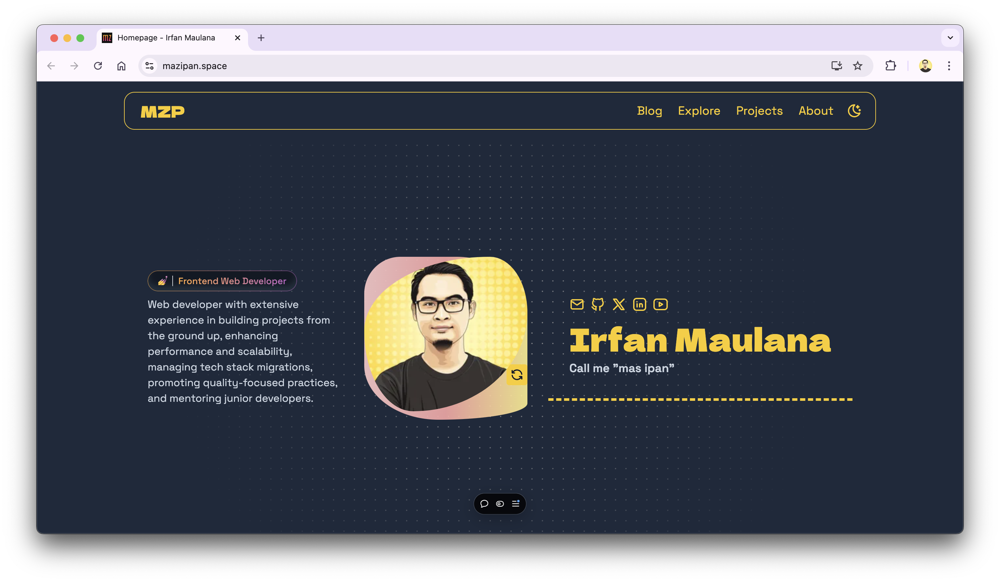

# mazipan.space

Codebase for ([mazipan.space](https://www.mazipan.space/))

## 🗂️ Tech Stacks

- Astro
- Tailwind CSS

## 📊 Analytics

https://umami.mazipan.space/share/O3odIJMu00TRHGhb/www.mazipan.space

## 💬 Giscus Comments

https://github.com/mazipan/blog-comments/discussions

## ⏪ Previous version

- [2024.mazipan.space](https://2024.mazipan.space/)

## 🔀 Use as a template

You can use this repo to bootstrap a same blog for yourself.
Feel free, just click **"Use this template"** button in this repo.

## 📈 Stats

## ⭐ Recognitions

- Project template from [nemanjam/nemanjam.github.io](https://github.com/nemanjam/nemanjam.github.io)
- Landing page copy from [www.iamtamara.design](https://www.iamtamara.design/)

---

Copyright © 2019 by Irfan Maulana
