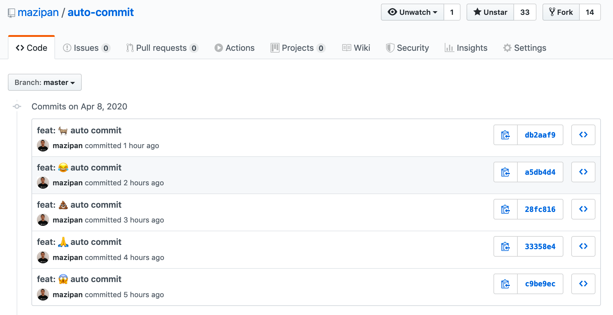

Long time not creating any commit for me because of my daily jobs using different Github account with my personal account `@mazipan`, this is for separating my activity for my professional job and my hobbies. This situation make my "Green" activity in my main account become white 😂
When first time knowing [Github Actions](https://help.github.com/en/actions), I already fall in love in the first sight with this feature. Finally, I can create my CI/CD without leaving the platform. Before Github Actions, I used third party service for maintaining my CI/CD, mostly on Travis CI, but I also exploring Circle CI in short time. I need to move from Github to Travis to see the logs and status of my CI/CD job. Maybe not a big thing for you, but for me it's quite wasting my time. Github Actions, come to solve this problem. I also believe that Github Actions will have seamless integration with the Github Platform since the already know their own platform. 

Yash, after exploring the Documentation and playing around in my open source repository I feel very helpful with this tools. Very handy, simple script, and works very well with the Github itself.

Back to my problem, I have idea to automatically create a commit in any repository to make Github recognize as an activity and mark a green square in my profile.
This problem is quite same with one of my use case in the [homepage repository](https://github.com/vuejs-id/homepage) in Vue.js Indonesia organisation that I helped to maintained, they use two repository, one for source of development and for the other one is for generated code by VuePress.

Susah-susah gampang. Susah, karena saya memang belum pernah mengerjakan model ini. Gampang, setelah mengerjakan (oh, ternyata cuma begini toh 😂).

## Get started with Github Actions

Configuration file for Github Actions is using Yaml and placed in the directory `.github/workflows`. In this folder we can create multiple file Yaml which is good for separating a job with different trigger or split some task to achieve better readability.

For my case, I will create configuration file named `.github/workflows/autocommit.yml`. First thing we will add in this file is field `name` so we can read the status easier based on the name we type in here. You can see this code to know how we adding a name in our Yaml:

```yaml
name: Auto commit
```

## Mengenal Trigger

Hal dasar yang umum mesti diketahui akan membuat CI menurut saya adalah mengerti soal trigger dan job. Trigger merupakan kode yang menentukan kapan CI kita akan dieksekusi, sedangkan Job adalah pekerjaan yang akan dijalankan ketika aturan dalam trigger telah terpenuhi. Di dalam Github Actions, Trigger ini dikenal dengan nama `Events` di Github Actions dan ditandai dengan sintaks `on` atau bahasa mudahnya "pas apa nih?". jadi pas lagi apa kode ini mau dijalankan. Karena saya mau melakukan pengujian terlebih dahulu, maka saya menambahkan Trigger pas lagi di `push` aja. Saya bisa menambahkan kode berikut:

```yaml
name: Auto commit
on:
  push:
    branches:
      - master
```

Bisa kembali disimak kodenya kalau masih ngawang-ngawang, kode diatas bisa dijelaskan bahwa saya menambahkan trigger ketika terjadi sebuah `push` pada branch `master` saya. Jadi setiap kali `push`, maka workflow `Auto commit` ini akan jalan.

Namun sebenarnya kan bukan ini yang ingin saya capai, saya mau membuat kode penjadwalan agar tidak perlu manual `push` terus-terusan. Maka dari itu saya menambahkan lagi Trigger yang akan dijalankan secara otomatis ketika waktu yang ditentukan sudah tercapai. Saya menambahkan kode berikut:

```yaml
name: Auto commit
on:
  push:
    branches:
      - master
  schedule:
  - cron: "0 7 * * *"
```

Bisa kita simak ulang ya kodenya. Kode diatas saya bisa jelaskan bahwa saya ingin workflow ini dijalankan setiap hari pada jam 7 pagi. Kalian lihat saya menambahkan dibawah `on` sejajar dengan `push` yakni `schedule` yang artinya menjadwalkan suatu pekerjaan. Jadwalnya menggunakan apa, paling gampang dan terkenal sih memanfaatkan cron string. Ini semacam text yang bisa kita gunakan untuk menentukan sebuah penjadwalan. Saya biasa menggunakan web [crontab.guru](https://crontab.guru/) kalau memang masih ragu dengan text yang sudah saya buat.

## Menambahkan tugas pada Github Actions

Menambahkan tugas atau job yang akan dijalankan pada saat trigger terpenuhi merupakan bagian utama yang biasanya sih susah-susah gampang. Pertama kita menambahkan kata kunci `jobs` yang menandakan dimulainya sebuah blok untuk tugas yang akan dijalankan. Dibawahnya kita kita bisa memberi nama pada job kita, saya memberikan nama `auto_commit`. Dalam satu workflow dan sekali trigger, kita bisa saja menambahkan lebih dari satu job. langkah berikutnya kita bisa mendefiniskan langkah-langkah secara berurutan yang harus dikerjakan dari job yang ingin kita buat. Berikut contoh kode sederhana untuk membuat job pada Github Actions:

```yaml
name: Auto commit
on:
  push:
    branches:
      - master
  schedule:
  - cron: "0 7 * * *"
jobs:
  auto_commit:
    runs-on: ubuntu-latest
    steps:
      - name: Test the jobs
        run: |
          echo "just another test"
```

Saya menambahkan satu langkan untuk pengujian saja, cuma mendefinisikan bahwa tugas ini akan dijalankan di sistem operasi *ubuntu* teranyar dan memberikan satu langkah yang isinya hanya mencetak kata "just another test".

Sampai disini kalian sudah bisa melakukan commit dan push ke branch `master` kalian untuk dilakukan pengecekan apakah workflow yang kita buat sudah dieksekusi dengan benar sesuai keinginan kita apa belum. Untuk mengeceknya, setelah kode kita push, kita bisas mengunjungi tab `Actions` pada repository kita (contoh: https://github.com/mazipan/auto-commit/actions) dan kita bisa melihat daftar workflow yang telah atau sedang dijalankan.

## Checkout git repository

Langkah pertama yang harus saya lakukan ketika memiliki tujuan untuk membuat commit otomatis adalah bisa *checkout* kode dari git repository yang sedang kita kerjakan saat ini. Salah satu hal keren dari Github Actions adalah modelnya yang bisa cabut pasang dari berbagai Actions yang sudah dipublikasikan, baik yang resmi dari Github maupun dari perorangan. Layaknya di JavaScript yang memanfaatkan banyaknya pustaka yang telah dipublikasikan untuk memudahkan tugas kita. Untuk melakukan *checkout* sendiri, sudah ada Actions resmi dari Github dan kita cukup menggunakannya saja. Berikut contoh kodenya:

```yaml
name: Auto commit
on:
  push:
    branches:
      - master
  schedule:
  - cron: "0 7,8,9,10,11 * * *"
jobs:
  auto_commit:
    runs-on: ubuntu-latest
    steps:
      - uses: actions/checkout@v2
        with:
         persist-credentials: false
         fetch-depth: 0
```

Cukup menambahkan `uses` dan gunakan nama dari Actions yang telah dipublikasikan. Actions yang kita gunakan berasal dari [https://github.com/actions/checkout](https://github.com/actions/checkout). Di bawahnya ada `with`, ini merupakan parameter yang ingin kita oper bersamaan pada saat memanggil Actions checkout tersebut. Dua parameter `persist-credentials` dan `fetch-depth` dibutuhkan untuk memastikan proses commit balik sukses dikarenakan ada issue terkait ini pada Actions yang akan kita gunakan nanti. Kita akan jelaskan pada bagian selanjutnya.

## Memastikan ada changes setiap saat

Agar bisa dilakukan commit dan push balik ke repository yang kita sedang gunakan, kita mesti memastikan bahwa ada perubahan (*changes*) yang terjadi pada salah satu atau beberapa berkas kita. Untuk menyiasati hal ini, saya membuat satu berkas yang nantinya akan saya perbarui setiap kali workflow ini dijalankan. Saya membuat berkas `LAST_UPDATED` yang tidak perlu diisi apapun pada saat ini. Kembali pada workflow kita,saya menambahkan kode sederhana untuk memanipulasi isi dari berkas yang telah kita buat ke dalam salah satu langkah dalam workflow kita. Berikut kodenya:

```yaml
name: Auto commit
on:
  push:
    branches:
      - master
  schedule:
  - cron: "0 7,8,9,10,11 * * *"
jobs:
  auto_commit:
    runs-on: ubuntu-latest
    steps:
      - uses: actions/checkout@v2
        with:
         persist-credentials: false
         fetch-depth: 0
      - name: Modify LAST_UPDATED file
        run: |
          d=`date '+%Y-%m-%dT%H:%M:%SZ'`
          echo $d > LAST_UPDATED
```

Bisa dilihat bahwa saya cuma mengisi berkas `LAST_UPDATED` dengan tanggal saat menjalankan workflow tersebut. 🙈

## Melakukan commit dan push balik

Kalau di lokal, kita biasa setelah membuat perubahan kita bisa menggunakan perintah `git commit -m "sebuah pesan"` kemudian `git push origin master` untuk menyelesaikan prosesnya. Di workflow ini pada dasarnya sama, hanya saja kita akan memanfaatkan Actions dari [ad-m/github-push-action](https://github.com/ad-m/github-push-action) untuk melakukan push balik ke repository kita.

Pertama, kita akan melakukan commit dengan kode berikut:

```yaml
name: Auto commit
on:
  push:
    branches:
      - master
  schedule:
  - cron: "0 7,8,9,10,11 * * *"
jobs:
  auto_commit:
    runs-on: ubuntu-latest
    steps:
      - uses: actions/checkout@v2
        with:
         persist-credentials: false
         fetch-depth: 0
      - name: Modify LAST_UPDATED file
        run: |
          d=`date '+%Y-%m-%dT%H:%M:%SZ'`
          echo $d > LAST_UPDATED
      - name: Commit changes
        run: |
          git config --local user.email "{YOUR_EMAIL}"
          git config --local user.name "{YOUR_USERNAME}"
          git add -A
          git commit -m "Sebuah pesan"
```

Kode diatas melakukan commit dengan sebelumnya kita set dengan email dan nama yang kita inginkan. Berikutnya menambahkan langkah baru untuk melakukan commit balik ke repository kita, berikut ini contoh kodenya:

```yaml
name: Auto commit
on:
  push:
    branches:
      - master
  schedule:
  - cron: "0 7,8,9,10,11 * * *"
jobs:
  auto_commit:
    runs-on: ubuntu-latest
    steps:
      - uses: actions/checkout@v2
        with:
         persist-credentials: false
         fetch-depth: 0
      - name: Modify LAST_UPDATED file
        run: |
          d=`date '+%Y-%m-%dT%H:%M:%SZ'`
          echo $d > LAST_UPDATED
      - name: Commit changes
        run: |
          git config --local user.email "{YOUR_EMAIL}"
          git config --local user.name "{YOUR_USERNAME}"
          git add -A
          git commit -m "Sebuah pesan"
      - name: Push Back
        uses: ad-m/github-push-action@v0.5.0
        with:
          force: true
          directory: "."
          github_token: ${{ secrets.GITHUB_TOKEN }}
```

Kita menggunakan Actions `ad-m/github-push-action@v0.5.0` dengan menambahkan parameter `force` untuk melakukan *force push*, `directory` dengan nilai titik yang artinya semua perubahan dari semua direktori akan di push balik, dan `github_token` dengan memanfaatkan token standar yang sudah ditanamkan oleh Github Actions sehingga kita tidak perlu menambahkan personal akses token kita secara manual.

Terkait dengan langkah *checkout* pada bagian sebelumnya yang diharuskan menambahkan parameter tambahan bersangkutan dengan issue [#44](https://github.com/ad-m/github-push-action/issues/44#issuecomment-590010727) yang pada repo `ad-m/github-push-action` yang telah dijawab oleh pembuatnya sendiri.

## Bagaimana dengan hasilnya?




Ya, kalian pada dasarnya bisa mengubah konfigurasi sendiri mau berapa kali dalam sehari commit otomatis ini dijalankan. Pada kasus saya, cukup 5 kali lah. Gak hijau-hijau amat, tapi lumayan lah tidak kering kerontang 🌳

## Sumber repository

Semua tulisan ini, didasarkan pada repository yang bisa kalian lihat pada tautan berikut:

[https://github.com/mazipan/auto-commit/](https://github.com/mazipan/auto-commit/)

---

Terima kasih dan semoga tidak disalahgunakan 🙏
