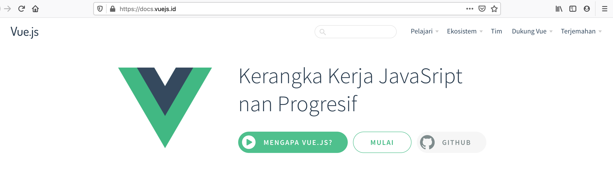

October is already ended, and the **HackToberfest** become **HackOverfest**. This article is trying to breakdown my hacking activities in this yearly festival.

## About Hacktoberfest

[Hacktoberfest](https://hacktoberfest.digitalocean.com/) is an event held by Digital Ocean and Dev.to along with its sponsors and supporters as a celebration of open source software and it open to everyone in global community.

Hacktoberfest have several rules, but in general you just need to make any certain number (4 in 2019) of pull request to any open source repository you like. 

Of course you need to sign up first on their website to make sure your contributions is tracked. 

When you made pull request as in the rule of game, you can claim rewards some swags like T-shirt and stickers.

## Year of VuejsID

This is my 3rd years participation in hacktoberfest. 

As a maintainer for several open source code, this event open many possibilities for other developers helping me to solving many small issues and chores I can not deal with it.

This year, I try to focusing my energy to finishing my personal goal. Driving the Vue.js community in Indonesia to continue our one small step in helping our own people to be easier learning Vue.js with the docs translation project. 

Actually, this project is already run for several months ago but we lost our focus and the progress was stucked without any contributors creating any pull requests again.

You can check the finish one in our website [docs.vuejs.id](https://docs.vuejs.id), the repo is already integrated with Netlify build so it will always update as our PR merged.

 
For achieving the goal to finish up the translation project, when the October started I also starting to create many issues to chunking the translation section for any contributors. 

With this they can easily pick their own issues, claim it and starting to work on the translation process.

I must say thank you very much for all contributors, You've very help us.

**VuejsID closed [35 PR in October](https://github.com/vuejs-id/docs/pulls?utf8=%E2%9C%93&q=is%3Apr+merged%3A2019-10-01..2019-11-01+) 🥳🥳🥳**

But actually, *it's not finish yet*. If you have time, please help us to pick the issue and translate the docs to Bahasa Indonesia.

## Helping first timers

Even I am very busy as a full time engineer in start-up, I do need help VuejsID to drive the translation project, I still have a some free time to manage my own repository to help people outside to create a simple contribution since so many first time contributors in this Hacktoberfest.

I want to help to learn the common workflow to contribute into open source code.

The repository is not new, already created since a years ago but I think it still relevant to help first timer contributor.

The repo success [merging 180 PR in October](https://github.com/mazipan/hello-open-source/pulls?utf8=%E2%9C%93&q=is%3Apr+merged%3A2019-10-01..2019-11-01+), at least I can help 180 different person to make their first open source contribution.

# My own contribution

I have privileged because I am an admin for several Github organization. 

This position is helping to achieve 4 pull requests this year, because I can fork my own repo from those organization and create my own pull requests then merged it by my self 🤣.

It very easy win for me.

But I see my team mate **Antony** creating a good repository called Gitcard, and I see he's not really focus on the UI area since it's very early phase.

I decided to create some PR to his repository to tackle UI issues. It also help me to achieve the pull requests target.

----

That's all, keep hacking!

