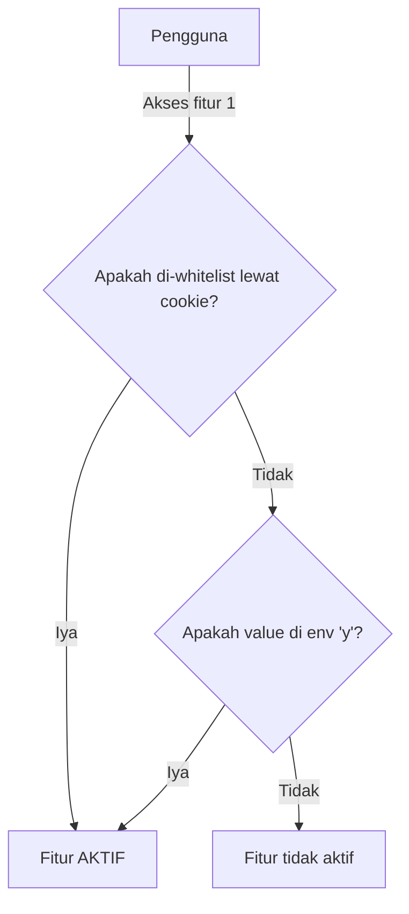

## 🚩 Mengenai fitur flag

Mengutip artikel dari [sko.dev](https://sko.dev/) - [**Apa itu feature flag: pengertian dan informasi**](https://sko.dev/wiki/feature-flag), "Feature flag adalah mekanisme yang memungkinkan developer untuk mengaktifkan atau menonaktifkan fitur tertentu dalam aplikasi secara dinamis, tanpa perlu melakukan deploy kode baru.". Silahkan baca artikelnya terlebih dahulu, cuma butuh beberapa menit saja untuk membaca keseluruhan artikelnya.

Saya pribadi tidak terlalu setuju dengan tambahan catatan bahwa feature flag ya harus selalu "tanpa perlu melakukan deploy kode baru", karena untuk mencapai fitur _live toggle_, waktu 10 menit mungkin tidak akan cukup. Mempersulit diri, kalau kamu membangun produk yang masih di tahap awal, di mana lebih membutuhkan kecepatan delivery dan kesederhanaan. Di tahap ini sebaiknya kita berusaha mengeliminasi kompleksitas yang tidak begitu diperlukan. Minimum fitur saja sudah cukup, asal bisa memecahkan problemnya.

## 🎯 Tujuan pembuatan fitur

Punya mekanisme untuk bisa deploy dari latest code tanpa perlu khawatir pengguna publik bisa dapat fitur-fitur yang memang belum siap untuk dilepas ke publik. Contoh kasus: Dalam 1 sprint ada 2 task, dimana yang satu task cukup sulit dan butuh waktu panjang development-nya, sementara satunya fitur kecil yang bisa dikerjain lebih cepat. Kebetulan fitur 1 yang sulit bisa jalan duluan, sementara fitur kedua yang mudah malahan baru bisa jalan beberapa hari setelahnya. Saya bukan tipe yang suka ngurusin rilis branch, lebih mudah rilis dari default branch aja, semua PR/MR langsung aja arahin ke default branch. Pas tiba waktunya deployment, fitur 1 yang sulit, sebagian kode sudah masuk ke defaut branch, sementara fitur 2 sudah selesai dan siap di deploy secepatnya. Saya perlu melakukan deployment fitur 2 tapi tidak mau mengekspos fitur 1. Tentu bisa saja diselesaikan dengan Cherry-Pick commit yang bersangkutan, sayangnya saya cukup malas ngurusin per-Git-an.

## 🍡 Macam-macam implementasi fitur flag

Implementasi fitur flag bisa macam-macam, bahkan bisa banget pakai saja 3rd party macam [Posthog](https://github.com/PostHog/posthog), [unleash](https://www.getunleash.io/) (FYI: GitLab memiliki integrasi dengan unleash), [flagsmith](https://www.flagsmith.com/) atau lainnya. Secara umum, saya membedakan ke dalam 2 tipe berdasarkan kebutuhan proses deploymentnya ketika membutuhkan toggle.

### 🔥 Feature flag tanpa deployment

Ini adalah fitur flag yang proper, di projek yang udah gede dan kompleks biasanya lebih memilih model yang ini karena memang tidak perlu menyentuh codebase untuk melakukan _switch-off_ maupun _switch-on_. [Posthog](https://github.com/PostHog/posthog) bisa ngasih sedikit gambaran mengenai fitur-fitur apa yang umumnya tersemat dalam sistem seperti ini. Fitur macam:

- ⚡ **Instant rollback**, live reload, runtime toggle atau apapun sebutannya. Memungkinkan kita untuk mengaktifkan dan deaktivasi tanpa melakukan deployment.
- 🚢 **Rollout management**, memungkinan kita untuk mengirimkan fitur ke production secara partial. Misal menggunakan strategi _percentage of users_, _percentage of traffics_, daftar pengguna, ID dari pengguna.
- 🍔 **Override**, memungkinan kita untuk memaksakan suatu hasil untuk suatu grup pengguna atau pengguna itu sendiri. Bisa digunakan untuk melakukan internal testing sebelum dilepas ke publik dengan memberikan sekelompok pengguna untuk bisa mengakses suatu fitur.

### 👾 Feature flag tapi butuh deployment

Bagian ini sebernarnya saya ingin menautkan dengan pendekatan di mana kita meletakkan sebuah _flag_ di dalam _environtment variable_, tapi kondisi memerlukan deployment juga pada dasarnya tergantung dari proses deployment kalian. Kalau mengacu pada ["The twelve-factor" di bagian Config](https://12factor.net/config), memang sebaiknya _environment variable_ atau konfig aplikasi berada di luar codebase, agar satu kali _build_ bisa di deploy ke berbagai environment yang berbeda. Artinya meskipun di sini saya menyebutkan membutuhkan deployment, tapi bisa saja tidak diperlukan. Sayangnya saya akan mencontohkan cara yang paling bar-bar, di mana perubahannya membutuhkan deployment karena memerlukan proses _build_ codebase ulang.

Kalau dikaitkan dengan project Next.js, jika kalian menggunakan env dengan prefix `NEXT_PUBLIC_` maka bisa dipastikan kalian memerlukan deployment ulang. Ini karena env value tersebut memang di _evaluate_ dan di-_replace_ pada saat _build-time_ ([baca dokumentasi terkait ini](https://nextjs.org/docs/pages/building-your-application/configuring/environment-variables#bundling-environment-variables-for-the-browser)).

## 🪂 Membuat fitur flag pertamamu di Next.js

Di artikel ini akan mencontohkan membuat fitur flag di projek frontend dengan framework Next.js yang telah menggunakan App Router, prinsipnya sama jadi jika masih menggunakan Pages Routes harusnya sih masih bisa dipakai dengan penyesuaian di beberapa tempat yang memang diperlukan.

Karena ditujukan untuk pemula, kita akan menggunakan cara yang paling mudah untuk dikerjakan. Kita akan menggunakan _build-time_ env seperti dijelaskan pada bagian sebelumnya, Meskipun Next.js mendukung _runtime_ env ataupun _runtime config_ untuk mengeliminasi keharusan melakukan _build_ ulang saat mengganti value, kita tidak akan menggunakannya karena saya pribadi berpendapat masih cukup sulit untuk pemula membedakan _build-time_ dan _runtime_ env, sehingga menggunakan cara yang paling jamak dan paling primitif diharapkan mengurangi keharusan memahami hal-hal tersebut, setidaknya pada kali ini.

Anggap saja kalian sudah punya basic Next.js projek dengan App Router-nya, saya tidak akan menjelaskan bagian tersebut. Berikut adalah langkah-langkah membuat Feature Flag ala-ala di projek Next.js:

### 1️⃣ Kode dasar feature flag dengan env var (2 menit)

Tambahkan env var baru, misal di dalam file `.env.development`, dengan isi:

```bash title=.env
NEXT_PUBLIC_FEATURE_1=y
```

Dengan kode ini, kita bisa menggunakannya baik di kode server maupun client dengan cara:

```typescript title=app.ts
if (process.env.NEXT_PUBLIC_FEATURE_1 === 'y') {
  // Fitur aktif
} else {
  // Fitur tidak aktif
}
```

Sehingga misalnya kita akan membuat sebuah fitur tombol yang hanya muncul saat `FEATURE_1` diaktifkan, kita bisa membuatnya dengan cara:

```tsx title=Home.tsx
export default function Home() {
  return (
    <main>
      <p>
        Status flag FEATURE_1: {process.env.NEXT_PUBLIC_FEATURE_1 === 'y' ? 'Aktif' : 'Non-Aktif'}
      </p>

      {process.env.NEXT_PUBLIC_FEATURE_1 === 'y' ? (
        <button role="button">Button Feature 1</button>
      ) : (
        <p>Tombol tidak muncul karena feature tidak aktif</p>
      )}
    </main>
  );
}
```

Sampai sini, kode fitur flag-nya sudah jalan sebenarnya. Sederhana dan mudah di toggle karena centralized di env var. Kalau mau mengaktifkan atau mematikan sebuah fitur, cukup mengubah value di env var nya saja. Fitur selesai.

### 2️⃣ Fitur whitelist user (8 menit)

Ada tambahan permintaan dari tim QA atau Tester, bagaimana cara mereka melakukan testing sementara posisi flag masih mati. Untuk inilah biasanya fitur flag punya fitur override atau whitelist seorang user agar bisa mengakses fitur yang bahkan kondisi untuk publik itu sebenarnya masih mati. Karena ini adalah versi poor man, maka kita akan ambil pendekatan yang paling "mungkin" dikerjakan dalam waktu singkat tapi masih bisa menyelesaikan kebutuhan dari tim QA atau Tester.

Cara paling mudah yang kepikiran adalah dengan memberikan penanda ke user tersebut, bahwa dia harus diberikan akses ke suatu fitur. Karena kita tidak melibatkan basis data, maka kita gunakan saja penyimpanan lokal bawaan yang ada di peramban. Bisa saja kita menggunakan [Web Storage API](https://developer.mozilla.org/en-US/docs/Web/API/Web_Storage_API) macam `LocalStorage` atau `SessionStorage`, sayangnya keduanya tidak mendukung kalau aplikasi kalian perlu di-_render_ di sisi server. Karenanya kita akan mencontohkan dengan [Cookie](https://developer.mozilla.org/en-US/docs/Web/API/Document/cookie) saja yang bisa jalan di server dan di client.

Alurnya bisa digambarkan seperti ini:



Lihat diagram di [mermaid.live](https://mermaid.live/edit#pako:eNpdj01vgkAQhv_KZi5e0ACCi3tog6Umppcm9VTxMIFFNsCugUVLkf_eFfVg5zLzzsfzZnpIVMqBQVaqc5Jjrck2iiUxEe4-uTwcWol7Mp2-kAsJi4Y3JBO6rYlj9KoPj1hgTlIxPedC81I0mpT8jJokShWCvw431upO2HRo1IW87dYjJfzYbtb7552tSLEwOXrQT1i23HgQLk9k0k0e0Og_9Ln94LzfvfSosdAi24MFFa8rFKl5vb_exaBzXvEYmClTrIsYYjmYPWy1-upkAkzXLbegPaaoeSTwUGMFLMOyMd0jSmA9_ABzaTAL6MILqO8uqbt0LeiAOY49Wyx92_PdYOG7gwW_Splze-YHNLC9uUM96s3NaGR9j8Or4fAH4S194w)

Salah satu yang mesti kita design selanjutnya adalah bagaimana value yang mau disimpan kedalam Cookie? Karena ada kemungkinan perlu mendukung whitelist ke dalam multiple feature flag, maka kita perlu membuat aturan agar value-nya mendukung kebutuhan ini. Misalnya, bisa dengan membuat string comma-separated macam csv, jadi misal ada 2 fitur maka kita menyimpannya dengan `feature_1,feature_2` atau bisa dengan semudah `JSON.stringify` saja, jadi misal ada 2 fitur maka kita menyimpan `["feature_1","feature_2"]`, keduanya sama-sama bisa jalan dan bisa menyimpan value lebih dari 1.

Next.js sudah memiliki built-in function untuk membaca Cookie yang hanya jalan di server, kita akan memanfaatkan fungsi tersebut biar lebih mudah dalam membaca Cookie. Baca lebih lanjut mengenai [function cookies](https://nextjs.org/docs/app/api-reference/functions/cookies). Contoh kodenya seperti berikut:

```js title=app/home/page.js
import { cookies } from 'next/headers';

export default function Page() {
  const cookieStore = cookies();
  const featureFlags = cookieStore.get('feature-flag');

  return '...';
}
```

Karena ada kemungkinan fungsi whitelist fitur flag ini akan digunakan di semua komponen di aplikasi kita, maka sebaiknya proses membaca Cookie diletakkan di level tertinggi saja, kita akan meletakkan di berkas `layout.ts` yang mana merupakan root dari semua halaman di projek Next.js. Sedangkan agar mudah digunakan di komponen manapun nantinya, kita akan memanfaatkan React Context untuk menyampaikan value tersebut. Berikut contoh kode di file `layout.ts`:

```tsx title=layout.ts
export default function RootLayout({ children }: { children: React.ReactNode }) {
  const cookieStore = cookies();
  const featureFlagsString = cookieStore.get('feature-flag');
  // Asumsi kita menyimpan cookie sebagai string dengan separator comma
  // Perlu di split terlebih dahulu agar jadi Array
  const featureFlags: string[] = (featureFlagsString?.value || '')?.split(',');

  return (
    <html lang="en">
      <body>
        <FeatureFlagProvider flags={featureFlags}>{children}</FeatureFlagProvider>
      </body>
    </html>
  );
}
```

Sedangkan contoh React Context dari kode di atas adalah:

```tsx title=feature-flag-context.tsx
'use client';

import { createContext, useCallback, useContext } from 'react';

import type { PropsWithChildren } from 'react';

export const FeatureFlagContext = createContext<{
  flags: string[];
  isEnabled: (key: string) => boolean;
}>({
  flags: [],
  isEnabled: (_key: string) => false,
});

export const FeatureFlagProvider = ({
  flags,
  children,
}: PropsWithChildren<{ flags: string[] }>) => {
  const isEnabled = useCallback(
    (key: string) => {
      if (Array.isArray(flags)) {
        return flags.includes(key);
      }
      return false;
    },
    [flags]
  );

  return (
    <FeatureFlagContext.Provider
      value={{
        flags,
        isEnabled,
      }}
    >
      {children}
    </FeatureFlagContext.Provider>
  );
};

export const useFeatureFlagContext = () => {
  return useContext(FeatureFlagContext);
};
```

Contoh penggunaan whitelist ini di level komponen, misalnya:

```tsx title=home.tsx
export default function Home() {
  const { isEnabled } = useFeatureFlagContext();

  const isFeature1Active = useMemo(() => {
    return isEnabled('feature_1') || process.env.NEXT_PUBLIC_FEATURE_1 === 'y';
  }, [isEnabled]);

  return (
    <main>
      <p>Status flag FEATURE_1: {isFeature1Active ? 'Aktif' : 'Non-Aktif'}</p>

      {isFeature1Active ? (
        <button role="button">Button Feature 1</button>
      ) : (
        <p>Tombol tidak muncul karena feature tidak aktif</p>
      )}
    </main>
  );
}
```

Fitur whitelist sudah selesai dibuat, tinggal kasih tau tim QA atau Tester soal bagaimana cara menambahkan Cookie lewat Developer Tools dan juga konvensi soal bagaimana untuk menambahkan multiple value.

### 3️⃣ Ekstra - Halaman untuk whitelist lewat UI (5 menit)

Bagian ini hanyalah ekstra, _optional_, tidak harus kalian buat. Tapi bila tim QA atau Tester kalian tidak begitu familiar dengan Developer Tools, mungkin sebaiknya dibuatkan saja halaman terpisah untuk bisa melakukan whitelist tersebut lewat UI dibandingkan manual menambahkan Cookie lewat UI.

Beberapa requirement-nya, antara lain:

👉 Sebaiknya membuat path halaman dengan alamat yang tidak mudah ditebak, kalau memang tanpa authorization, karena tujuannya kan buat penggunaan internal.

👉 Bisa menampilkan daftar fitur flag yang ada saat ini, beserta initial kondisinya, apakah enable atau tidak untuk seorang pengguna.

👉 Bisa menambahkan whitelist terhadap fitur flag tertentu, yang berarti walaupun kondisinya sedang mati, saat kita melakukan whitelist, maka fitur tersebut jadi enable untuk pengguna tersebut

Silahkan berkreasi sendiri soal halaman ini ya! 🤡

## ‼️ Resiko Tambahan

Kode dengan fitur flag pada dasarnya kode yang percabangannya bisa makin banyak, mesti punya strategi yang baik untuk ngatur daftar fitur flag di dalam codebase biar gak menumpuk padahal sudah tidak dibutuhkan lagi alias sudah sepenuhnya dinyalakan dan tidak ada rencana untuk mematikan kedepannya. Saya sendiri sering menggunakan fitur flag untuk menjaga kode-kode yang belum siap rilis, yang mana setelah dirilis 100%, fiturnya biasanya sudah tidak akan dimatikan lagi.

Kecuali memang ada rencana untuk suatu saat diperlukan nyalakan/matikan ulang, maka bersih-bersih fitur flag jadi kerjaan tambahan yang mesti rajin-rajin diambil.

Strateginya macam-macam, bisa semudah dengan ditandain aja pake `// TODO` biar gampang di spot, kalau perlu buat dedicated tiket untuk menghapus kodenya apalagi kalau kita sudah bisa mengira-ngira kapan fitur tersebut bisa dirilis, atau strategi lain yang dirasa cocok dan tidak dirasa memberatkan. Tujuannya sih biar menjaga kodenya tidak menumpuk padahal sudah tidak pernah digunakan lagi.

## 👋 Sekian dan terima kasih

Maaf-maaf aja kalau gak bermanfaat 🙇😭

---

Foto cover diambil dari laman [Pexel](https://www.pexels.com/id-id/foto/orang-mengenakan-cincin-perak-dengan-manikur-putih-5870547/), Foto oleh [cottonbro studio](https://www.pexels.com/id-id/@cottonbro/)
