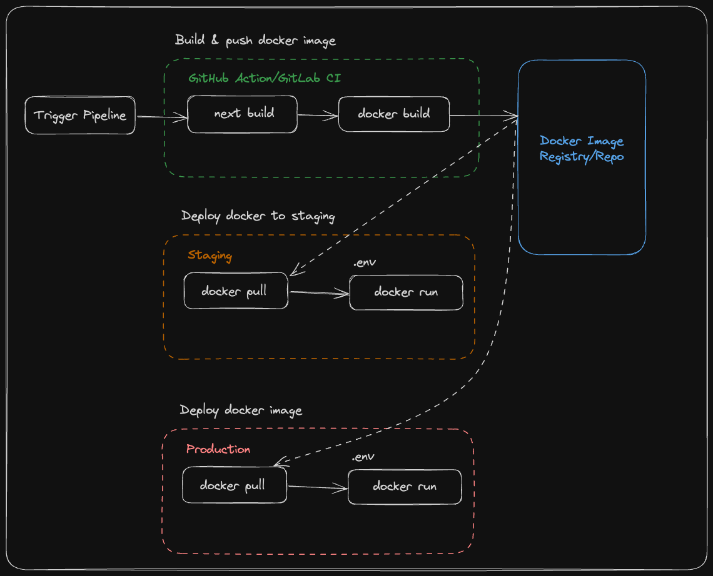

import Alert from '@/components/Alert.astro';

Artikel mengenai bagaimana Next.js menangani env var sebenarnya bisa dibaca secara tuntas di dokumentasi resmi mereke "[Environment Variables di Next.js](https://nextjs.org/docs/app/building-your-application/configuring/environment-variables)". Artikel yang saya tulis hanya pengulangan pembahasan bagi yang masih kesulitan memahami artikel tersebut, jadi kalau kalian merasa topik pembahasan ini terlalu sepele untuk kalian, saya sarankan untuk berhenti meneruskan membaca dan cukup mengabaikannya saja.

## Mengenai env var

Env var atau _environment variable_ marupakan variabel dinamis di luar dari program/aplikasi, biasanya merupakan bawaan dari sistem operasi suatu mesin, yang dapat mempengaruhi bagaimana program tersebut bekerja di sistem operasi tersebut.

Beberapa kegunaan utama dari env var dalam pengembangan perangkat lunak adalah:

- **🔧 Konfigurasi Aplikasi**: Menyimpan nilai-nilai konfigurasi seperti URL basis data, kredensial, dan kunci API tanpa harus menyimpannya dalam kode sumber.

- **🌲 Pengelolaan Lingkungan**: Membantu mengelola berbagai lingkungan (development, staging, production) dengan konfigurasi yang berbeda-beda.

- **🛡️ Keamanan**: Menyimpan informasi sensitif seperti password dan token yang tidak boleh disimpan dalam kode sumber.

- **📦 Portabilitas**: Memungkinkan aplikasi untuk dengan mudah dipindahkan dan dijalankan di berbagai sistem dengan sedikit atau tanpa perubahan pada kode.

Env var berisi pasangan "_key-value_", dan biasanya disimpan dalam file `.env` yang dibaca secara otomatis sebagai env var tambahan yang didefinisikan untuk dibutuhkan saat aplikasi tersebut akan dijalankan.

Contoh isi dari sebuah `.env`:

```bash title=.env frame=terminal
# Contoh env var
DOMAIN_APLIKASI="https://mazipan.space"
DOMAIN_ASET="https://imagekit.io/sebuah-alamat"
```

## Env var di Node.js

Dari artikel [How to read environment variables from Node.js](https://nodejs.org/en/learn/command-line/how-to-read-environment-variables-from-nodejs), pada dasarnya Node.js bisa otomatis membaca env var yang ada di sistem operasi semudah dengan kode `process.env.SEBUAH_ENV_VAR`. Jadi misal di sebuah sistem operasi terdapat env var seperti berikut:

```bash title=.env frame=terminal
# Contoh env var
DOMAIN_APLIKASI="https://mazipan.space"
DOMAIN_ASET="https://imagekit.io/sebuah-alamat"
```

Maka kamu bisa membaca di Node.js dengan kode berikut:

```js title=index.js
console.log(process.env.DOMAIN_APLIKASI); // "https://mazipan.space"
console.log(process.env.DOMAIN_ASET);     // "https://imagekit.io/sebuah-alamat"
```

Dalam kasus misalnya env var tersebut didefinisikan melalui file `.env`, kamu perlu menambahkan sedikit perintah saat menjalankan program, contohnya:

```bash title=zsh frame=terminal
node --env-file=.env index.js
```

📝 **Catatan**: argumen `--env-file` baru didukung di Node versi 20 ke atas.

## Env var di React.js

React.js dasarnya adalah javascript framework yang awalnya "hanya" jalan di peramban, maka secara natural dia sebenarnya memang **tidak bisa membaca env var**. Env var hanya bisa di-_supply_ dari kode Node.js (server-side) ke kode React melalui cara-cara yang dimungkinkan. Salah satunya adalah melalui proses *replacement* saat build production asset melalui build tool seperti Webpack atau Vite. Saat proses build tersebut berlangsung, kita bisa menambahkan proses untuk me-*replace* kata-kata `process.env.SOMETHING` dengan sesuatu yang statik sehingga nantinya bisa dijalankan di peramban dengan aman.

## Env var di Next.js

Memasuki era SSR di mana kode client dan server yang digunakan sama persis (sama-sama JavaScript), memberikan kemungkinan kita untuk menulis kode yang sama yang bisa jalan di dua lingkungan yang berbeda. Menggunakan Node.js (atau runtime lainnya) saat di server dan melalui renderer bawaan peramban seperti biasa ketika sampai di client. Jadinya, kode React yang sama, bisa saja di-render di lingkungan Node.js ataupun bisa di-render di peramban.

Kemampuan ini mengaburkan beberapa pengetahuan sebelumnya karena jadi semakin rancu, apakah kode yang ditulis ini akan jalan di server atau di klien? Seperti dijelaskan sebelumnya `process.env.SOMETHING` hanya tersedia di lingkungan server, sehingga kita bisa tau bahwa menuliskan `process.env.SOMETHING` di kode React sebenarnya sangat mungkin, **tapi** hanya jika kita yakin kode React tersebut akan hanya dijalankan di lingkungan server. Sementara jika kode tersebut bisa berjalan di lingkungan klien, maka diperlukan *workaround* tambahan untuk "seolah-olah" bisa menggunakan `process.env.SOMETHING`.

<Alert variant="info">
Ketika bekerja dengan meta framework semacam Next.js ini yang perlu diperhatikan adalah, si software developer/programmer sebaiknya bisa membedakan mana kode yang cuma jalan di server, mana yang cuma jalan di klien atau peramban, dan mana yang bisa saja jalan di server dan di klien.
</Alert>


### Static env var di Next.js

Tipe env var ini adalah tipe env var yang harus di-*supply* saat proses build. Kenapa? Karena nantinya diperlukan proses replacement menjadi value statik, sehingga tipe ini pada dasarnya aman digunakan di semua kode baik yang berjalan di server maupun di klien.

Menggunakan statik env var di Next.js bisa dengan menambahkan prefix `NEXT_PUBLIC_`. Ini adalah konvensi dari Next.js untuk menandai bahwa si env var akan digantikan dengan nilai statik pada saat proses build.

Dengan contoh kita memiliki kode env var seperti berikut:

```bash title=.env frame=terminal
NEXT_PUBLIC_SAMPLE='statik'
```

Maka kita bisa memberikan contoh penggunaan pada kode React sebagai berikut:

```tsx title="app/home/page.tsx"
// 'NEXT_PUBLIC_SAMPLE' can be used here as it's prefixed by 'NEXT_PUBLIC_'.
// It will be transformed at build time to "Hello from statik"`.

function HomePage() {
  return <h1>Hello from {process.env.NEXT_PUBLIC_SAMPLE}</h1>
}

export default HomePage
```

### Runtime env var di Next.js

Ini adalah tipe yang hanya akan di-supply di saat aplikasi tersebut berjalan, artinya kembali ke naturalnya env var, hanya akan tersedia bila kamu melakukan deployment Next.js ke server dan menggunakan fitur-fitur server side rendernya. Bila kamu menggunakan SSG, maka kamu tidak bisa menggunakan tipe env var ini.

Untuk tipe aplikasi SSR di mana aplikasi dijalankan di server dan melakukan proses render initial halamannya di server, Next.js tidak menambahkan konvensi apapun. Artinya semua env var selain yang memiliki prefix `NEXT_PUBLIC_` akan dianggap sebagai runtime env var dan hanya akan aman untuk digunakan pada lingkungan server. Yang sering jadi kebingungan adalah apakah berarti env var dengan prefix `NEXT_PUBLIC_` tidak bisa digunakan di sisi server? Kembali ke penjelasan pada bagian sebelumnya, sangat bisa. Hanya saja nilainya akan statik karena di evaluate saat proses build berlangsung. Jika kalian punya satu env var statik yang nilainya berbeda antara proses build dan runtime, maka Next.js akan mengambil nilai saat proses build dan tidak akan mengindahkan nilai yang diberikan saat runtime.

## Menggunakan runtime env var di kode klien

Telah disebutkan di atas, kode klien tidak dapat membaca env var. Maka untuk tipe runtime env var, dimana ini adalah tipe env var yang sesungguhnya (bukan cosplay -- seperti sering disebut oleh sebuah akun X). Maka secara natural, harusnya kode klien memang tidak bisa menggunakan nilai-nilai yang ada pada env var ini.

Namun karena kita juga tau, bahwa yang di-render di server oleh Next.js ini adalah juga kode React, maka sebenarnya kita bisa juga menggunakan fitur React.js ataupun fitur native peramban pada umumnya.

<Alert variant="danger">
Hati-hati ketika ingin melempar nilai env var server ke klien, pastikan bukan sebuah *"secret"*. Pilih env var yang memang aman untuk di expose ke klien saja. Tanya ke yang lebih senior, kalau belum bisa membedakan antara *"secret"* dan bukan. Kuncinya ketika bingung: Anggap aja semua yang di server itu *"secret"*.
</Alert>

Berikut beberapa workaround yang bisa dilakukan, tidak diurutkan berdasarkan preferensi, jadi suka-suka saya aja mana yang mau saya bahas duluan dan belakangan, semoga tidak jadi dasar pengambilan keputusan untuk kalian, berikut diantaranya:

### Lemparkan melalui React.Props

Seperti bisa ketikan ingin mengalirkan data dari sebuah parent ke child di React, kamu bisa menggunakan Props. Sama ketika kita ingin mengalirkan data dari kode yang di render di server ke klien. Bahkan jika nantinya di klien akan dimuat dinamis (dengan `next/dynamic`) dan hanya akan dijalankan di klien, Props tersebut tetap bisa digunakan.

Dengan asumsi kalian sudah menggunakan App Router, kalian bisa menggunakan `process.env.SOMETHING` langsung di kode React, tanpa perlu menambahkan `getServerSideProps`. Contoh kodenya:

```tsx title=app/layout.tsx
export default function RootLayout({
  children,
}: {
  children: React.ReactNode
}) {
  const exposedEnvVar = {
    name: process.env.APP_NAME,
    version: process.env.APP_VERSION
  }

  return (
    <body className="app-body">
      <App envVar={exposedEnvVar}>
        {children}
      </App>
    </body>
  )
}
```

Bila terlalu dalam, maka gunakan `React.Context` untuk mengalirkan data ke semua aplikasi.

Untuk kalian yang masih berkutat dengan Pages Router, maka kalian bisa menggunakan [getServerSideProps](https://nextjs.org/docs/pages/building-your-application/data-fetching/get-server-side-props), contohnya:

```tsx title=pages/home.tsx
import type { InferGetServerSidePropsType, GetServerSideProps } from 'next'

type PageProps = {
  appEnv: Record<string, string>
}

export const getServerSideProps = (async () => {
  const exposedEnvVar = {
    name: process.env.APP_NAME,
    version: process.env.APP_VERSION
  }

  // Pass data to the page via props
  return {
    props: {
      appEnv: exposedEnvVar
    }
  }
}) satisfies GetServerSideProps<{ appEnv: PageProps }>

export default function Page({
  appEnv,
}: InferGetServerSidePropsType<typeof getServerSideProps>) {
  return (
    <main>
      <p>Env name: {appEnv?.name}</p>
      <p>Env version: {appEnv?.version}</p>
    </main>
  )
}
```

Kalau di rasa merepotkan untuk menambahkan di setiap halaman, bisa juga gunakan [CustomApp](https://nextjs.org/docs/pages/building-your-application/routing/custom-app) yang menggunakan konvensi nama file `_app.tsx`, contohnya:

```tsx title=pages/_app.tsx
import App, { AppContext, AppInitialProps, AppProps } from 'next/app'

type AppOwnProps = {
  appEnv: Record<string, string>
}

export default function MyApp({
  Component,
  pageProps,
  appEnv,
}: AppProps & AppOwnProps) {
  return (
    <>
      <p>Env name: {appEnv?.name}</p>
      <p>Env version: {appEnv?.version}</p>
      <Component {...pageProps} />
    </>
  )
}

MyApp.getInitialProps = async (
  context: AppContext
): Promise<AppOwnProps & AppInitialProps> => {
  const ctx = await App.getInitialProps(context)

  const exposedEnvVar = {
    name: process.env.APP_NAME,
    version: process.env.APP_VERSION
  }

  return { ...ctx, appEnv: exposedEnvVar }
}
```


### Selipkan ke object window

Kode Next.js di server akan menghasilkan paling tidak sebuah html yang akan di hydrate di sisi klien agar bisa mengembalikan fitur interaktif di kode React. Karena kita tau akan menghasilkan HTML, maka kita bisa saja menambahkan kode untuk menyelipkan env var yang tadinya hanya tersedia di server agar juga tersedia di object global window di sisi klien. Contoh kodenya:

```tsx title=app/layout.tsx
export default function RootLayout({
  children,
}: {
  children: React.ReactNode
}) {
  return (
    <body className="app-body">
      <Script id="app-env">
        {`
            window.__AppEnv={APP_NAME:"${process.env.APP_NAME}",APP_VERSION:"${process.env.APP_VERSION}"};
        `}
      </Script>
      {children}
    </body>
  )
}
```

Kelemahan `window` object memang karena bukan native fitur React jadinya tidak reaktiv dan perlu effort tambahan untuk bisa mengggunakan di berbagai fitur React, tapi mudah digunakan di fitur lain di luar React, misal digunakan di `helper` atau `utility` function lainnya.

### Cara lainnya

Kamu tau cara lain? Silahkan tambahkan cara lain untuk mengakses runtime env var melalui kolom komentar di bagian bawah artikel ini. <a href="#giscus-comments">Scroll langsung ke bagian komentar.</a>

## Contoh kasus umum

Mampu membedakan statik env var dan runtime env var penting untuk menghindarkan dari tebak-tebak buah manggis. Tidak perlu rancu lagi, apakah ini bisa dipakai di kode bagian sini atau tidak.

Gambar di bawah adalah sketsa alur deployment yang disederhanakan dari sebuah proses `build-deploy` yang umumnya dilakukan saat memilih cara metode containerization.



Proses antara build dan deploy terpisah di 2 lingkungan yang berbeda. Proses build biasanya saja terjadi di lingkup CI, di mana berarti semua env var yang dibutuhkan akan diletakkan pada platform CI tersebut. Sementara saat proses deploy dan menyalakan aplikasinya kita juga akan menyediakan env var runtime yang dibutuhkan si aplikasi agar bisa berjalan sesuai dengan lingkungan tujuannya, misal untuk lingkungan `staging` ataupun `production`.

Contoh kasus umum yang seringkali dialami gara-gara kesalahan menggunakan env var ini, misalnya kalian membangun aplikasi SSR dengan Next.js, dan melakukan deployment dengan menggunakan Docker Image, sedangkan kalian memiliki lingkungan deployment lebih dari satu (misalnya: `staging` dan `production`). Mengingat sifat Docker Image yang sebaiknya immutable, tidak lagi diubah isinya saat sudah dibuat. Maka seharusnya Docker Image yang telah di-*build* sebelumnya, bisa di deploy dimanapun, baik `staging` ataupun `production`. Hal-hal yang membedakan antara `staging` dan `production` seharusnya di-*supply* lewat konfigurasi env var di masing-masing lingkungannya. Sayangnya ini jadi tidak bisa dicapai bila di dalam kode Next.js nya ternyata menggunakan statik env var. Misalnya untuk mendefinisikan sebuah domain projek, mereka menambahkan env var untuk staging sebagai berikut:

```bash title=.env.test frame=terminal
NEXT_PUBLIC_SITE_URL='https://www.staging-app.com'
```

Sedangkan untuk production, mereka membuat env berbeda:

```bash title=.env.production frame=terminal
NEXT_PUBLIC_SITE_URL='https://www.production-app.com'
```

Hal ini menjadikan kalian tidak bisa menggunakan 1 Docker Image yang sama untuk `staging` dan `production`. Karena katakanlah kalian sudah melakukan build untuk staging terlebih dahulu, maka nilai `process.env.NEXT_PUBLIC_SITE_URL` sudah keburu menjadi statik di dalam Docker Image tersebut dengan nilai staging `https://www.staging-app.com`.

Untuk jenis aplikasi yang SSR, sebaiknya memang full sekalian pakai runtime env var. Berbeda cerita kalau jenis aplikasi yang dibuat tidak memerlukan server dan hanya di deploy statik.

## Bahan bacaan lanjutan

- [Environment Variables untuk Pages Router](https://nextjs.org/docs/pages/building-your-application/configuring/environment-variables)
- [Environment Variables untuk App Router](https://nextjs.org/docs/app/building-your-application/configuring/environment-variables)
- [Container Image Immutability and the Power of Metadata](https://www.cloudbees.com/blog/container-image-immutability-power-metadata)

---

**👋 Sekian dan terima kasih**

Maaf-maaf aja kalau gak bermanfaat 🙇😭

---

Foto cover diambil dari laman [Pexel](https://www.pexels.com/id-id/foto/orang-yang-mengumpulkan-sampah-di-tempat-pembuangan-akhir-3230539/), Foto oleh [Mumtahina Tanni](https://www.pexels.com/id-id/@mumtahina-tanni-1080117/)
