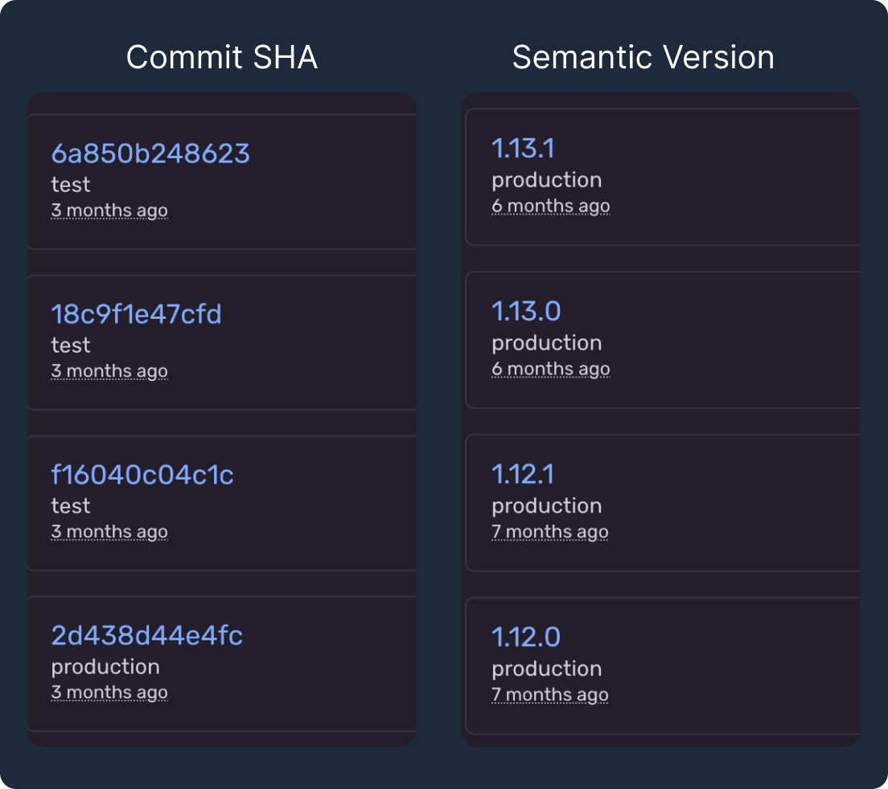

import Alert from '@/components/Alert.astro';

## Mengenai semantic version

Membaca penjelasan mengenai semantic version memang sebaiknya mengacu pada spesifikasi yang bisa dibaca di website [semver.org](https://semver.org/).

Secara singkat semantic version adalah konvensi yang disepakati bersama tentang bagaimana menuliskan versi untuk suatu software.

Setiap bagian di semantic version dipisah dengan tanda titik, Paling tidak ada 3 bagian di semantic version, bila kita ambil contoh sebuah versi `1.2.3`, maka kita bisa jelaskan dengan sederhana, bahwa:

- `1` adalah major version.
- `2` adalah minor version.
- `3` adalah patch version.

Selain ketiga bagian di atas, kita bisa juga menambahkan label tambahan seperti pre-release atau metadata build, seperti contohnya: `1.0.0-beta`, `2.0.0-rc.1`, dan lain sebagainya.

Menaikkan semantic version biasanya berdasarkan dari perubahan yang terjadi dibandingkan versi sebelumnya.

- Versi `major`, menyiratkan adanya suatu perubahan besar, mengakibatkan *"breaking"* bila tidak diubah sesuai spesifikasi baru.
- Versi `minor`, menyiratkan adanya penambahan fitur baru tanpa menimbulkan *breaking* bagi yang tidak menggunakan fitur tersebut secara langsung.
- Versi `patch`, perbaikan terhadap kesalahan-kesalahan yang terjadi pada versi-versi sebelumnya.

<Alert variant="info">
Meskipun sudah ada panduannya, tidak jarang anjuran ini juga tidak diikuti secara *"strict"*, sehingga sebagai pengguna akhir sebaiknya memang tetap melakukan pengecekan ulang ketika diharuskan untuk menaikkan versi dari suatu dependency yang kita gunakan.
</Alert>

## Kebutuhan semantic version di Library

Untuk kasus suatu library, dengan adanya version, memungkinkan pengguna untuk melakukan *lock* terhadap versi yang mereka butuhkan, sehingga tidak perlu mengambil semua perubahan terbaru yang seringnya tidak relevan dengan aplikasi yang sedang dibangun.

Semantic version membuat perubahan bisa lebih diprediksi, bila pengguna melihat ada suatu `patch` version baru, si pengguna bisa berasumsi kalau aplikasi yang menggunakan library tersebut harusnya aman juga untuk menaikkan versi yang digunakan ke versi yang lebih baru.

Banyak peralatan yang bisa digunakan untuk membantu mengatur versi dependency agar bisa otomatis rilis dengan versi yang tepat berdasarkan perubahan yang terjadi, salah satu yang populer adalah [🦋 changesets](https://github.com/changesets/changesets) yang dikombinasikan dengan konvensi commit yang tepat seperti [conventionalcommits.org](https://www.conventionalcommits.org/en/v1.0.0/).

## Semantic version di Aplikasi Mobile

Sebelum membahas di platform web, saya ingin membahas sedikit tentang tetangga sebelah. Di Aplikasi Mobile yang harus dirilis ke store pihak ketiga, sudah barang wajib mesti mencatumkan versi pada setiap rilis perubahannya. Bahkan di banyak kasus diperlukan juga menyediakan rilis notes mengenai perubahan yang terjadi dengan jelas dan mudah diakses ketika ingin melakukan update versi. Kita bisa bilang, bahwa dari hari pertama, Aplikasi Mobile sudah di design agar memiliki versioning yang baik karena pengguna bisa dengan mudah menyadari karena ada effort untuk unduh ulang saat harus memperbarui versi terbaru.

## Masalah semantic version di web

Salah kelebihan web memang distribusinya yang mudah dan mendekati instan, tidak perlu persetujuan dari pihak ketiga bahkan tanpa persetujuan dari si penggunanya sendiri, begitu kita rilis versi baru maka saat itu juga perubahan bisa langsung didapatkan oleh pengguna.

Kelebihan ini juga yang memungkinkan para web developer untuk rilis perubahan yang diperlukan dengan lebih sering. Sayangnya dengan semakin mengingkatnya frekuensi perilisan kode baru, sudah umum juga kalau prosedur perilisan biasanya menjadi semakin lemah.

Karena kecepatan delivery, dan tidak terlalu relevannya semantic version untuk aplikasi web karena memang tidak membutuhkan proses review pihak ketiga untuk bisa rilis, banyak aplikasi web yang hanya menggunakan versioning alakadarnya seperti menggunakan `timestamp` waktu deployment dilakukan atau `commit hash` yang merupakan identitas dari commit terakhir dari kode yang akan di deploy ataupun kombinasi keduanya. Hal ini pun biasanya dilakukan hanya untuk *"ceremony"* karena memang peralatan yang digunakan untuk perilisan membutuhkan suatu versi, misalnya karena harus membuat git tag maka membuat git tag dengan timestamp saja cukup, atau karena harus menggunggah Docker Image atau asset lain yang dibutuhkan ke suatu tempat, maka menggunakan `commit hash` saja sudah cukup.

## Mengapa semantic version di web juga dibutuhkan?

Jadi untuk apa semantic version diperlukan saat melakukan development aplikasi web, secara garis besar adalah untuk mempermudah bahasa komunikasi, secara detail beberapa yang bisa dijelaskan antara lain:

### Satu bahasa komunikasi

Di banyak kasus, software development akan melibatkan banyak pihak. Banyak pihak ini sebaiknya memiliki satu bahasa yang sama ketika menyebutkan versi dari suatu software.

Misalkan ketika kita perlu melakukan perilisan versi baru, dibandingkan kita menyampaikan bahwa kita akan rilis versi `20241218-11400000` atau `f0270f69793ddb6865f2510d334864b093cb10e3` dengan perubahan A, B, C, akan lebih mudah untuk menyampaikan kalau kita akan rilis versi `1.2.3`.

Di waktu lain, kita bisa saja akan mendapatkan pertanyaan dari pihak lain, misalnya pertanyaan: "Eh fitur A sejak kapan ada di production ya?". Kita bisa menyebutkan bahwa fitur A sudah ada sejak versi `1.2.3`.

Dengan punya satu bahasa yang sama-sama dipahami dan mudah dilafalkan, maka berbagai stakeholder jadi punya referensi yang sama mengenai versi aplikasi yang sedang dibahas.

### Lebih mudah untuk melihat masa lalu

Dengan melihat perubahan versinya, kita jadi bisa mengetahui dalam setahun ini kira-kira ada fitur besar apa saja yang sudah kita deliver. Jika masih berkutat dengan minor dan patch saja, kita bisa berasumsi bahwa perubahan yang terjadi kebanyakan menggunakan pendekatan *incremental* sehingga tidak diperlukan rilis besar-besaran.

Dibekali dengan tambahan dokumen pendukung berupa dokumen perubahan versi, lebih mudah untuk melihat ke belakang, hal-hal apa saja yang sudah kita kerjakan selama beberapa waktu.

### Lebih mudah mengurutkan



Kalau kedua versioning ini disandingkan, jadi kelihatan lebih mudah buat manusia untuk mengurutkan mana versi yang lebih baru dari yang lain. Walaupun hal yang sama sebenarnya juga bisa dicapai dengan menggunakan `timestamp`, tapi dari sisi keterbacaan semantic version masih lebih baik.

---

Dari berbagai kebutuhan di atas, fokus utamanya memang ada di manusianya, bagaimana agar para makhluk di belakang suatu web application bisa lebih cepat paham ketika menyebutkan suatu versi.

<Alert variant="info">
Semantic version dibuat agar lebih mudah dibaca sebagai manusia. Sebagai sistem, mudah saja untuk memahami versi dengan timestamp maupun commit hash, tapi tidak dengan mata manusia.
</Alert>

## Menambahkan semantic version di aplikasi Next.js

**🟢 Permasalahan pertama** yang muncul adalah di mana kita akan meletakkan versi aplikasi kita? Secara bawaan, setiap aplikasi JavaScript sudah memiliki tempat untuk meletakkan versi aplikasi yakni di file `package.json` yang juga berisi daftar dependency yang dibutuhkan. Jadi kalau tidak mau ambil pusing dengan berbagai peralatan baru yang perlu diintegrasikan ke project kalian, pakai saja cara manual dengan menaikkan versi di `package.json` setiap kali akan melakukan deployment baru.

Sedikit kembali mengingatkan, sudah ada cara mudah yang disediakan package manager untuk menaikkan versi ke versi berikutnya. Contohnya untuk `npm` bisa menggunakan perintah [npm version](https://docs.npmjs.com/cli/v11/commands/npm-version), contohnya:

```bash title=zsh frame=terminal
npm version [<newversion> | major | minor | patch | premajor | preminor | prepatch | prerelease | from-git]
```

Tentu saja cara yang saya sebutkan adalah cara termudah untuk memulai, kalau kalian sudah cukup advance dan familiar dengan berbagai peralatan di JavaScript sebaiknya langsung saja memulai dengan [🦋 changesets](https://github.com/changesets/changesets) agar tidak perlu manual mendeteksi patch, minor atau major lagi.

**🟢 Permasalahan kedua**, bagaimana cara Next.js tau versi yang ada di `package.json` kita? Cara yang saya kepikiran sih dengan *inject* versi yang ada di `package.json` ke dalam env var yang ada di Next.js. Untuk kasus ini, aman untuk menggunakan statik env var karena versi ini tidak akan berubah bahkan bila di deploy ke environment yang berbeda. Kita akan inject env var berikut saat build time `NEXT_PUBLIC_SEMANTIC_VERSION=[versi dari package.json]`, seperti kalian baca pada artikel sebelumnya "[Memahami environment variable di Next.js](/blog/2024-07-18-understanding-env-var-in-nextjs)" bahwa env var statik itu di-*supply* saat proses build bukan saat proses run aplikasi.

Cara paling mudah inject env var ini adalah dengan menambahkan env pada script `next build` di `package.json`, jadi jika sebelumnya kurang lebih begini:

```json title=package.json
{
  "scripts": {
    "build": "NEXT_PUBLIC_SEMANTIC_VERSION=[versi dari package.json] next build"
  }
}
```

Sekarang tinggal cari cara print versi dari `package.json`, agar bisa diselipkan ke script tersebut. Jika kalian mau memanfaatkan fitur `npm`, sudah ada command: `npm pkg get version`, sehingga kita bisa memperbarui script tersebut menjadi:

```json title=package.json
{
  "scripts": {
    "build": "NEXT_PUBLIC_SEMANTIC_VERSION=$(npm pkg get version | xargs) next build"
  }
}
```

Kalau yang lebih suka akrobat, bisa menggunakan berbagai variasi command, seperti diantaranya bisa ditemui di gist [get-npm-package-version](https://gist.github.com/DarrenN/8c6a5b969481725a4413), saya rangkumkan sedikit:

```json title=package.json
{
  "scripts": {
    "build:npm-v": "NEXT_PUBLIC_SEMANTIC_VERSION=$(npm v ./ version) next build",
    "build:jq": "NEXT_PUBLIC_SEMANTIC_VERSION=$(jq -r .version package.json) next build",
    "build:cat-grep": "NEXT_PUBLIC_SEMANTIC_VERSION=$(cat package.json | grep \"version\" | cut -d'\"' -f 4) next build"
  }
}
```

**🟢 Permasalahan ketiga**, yang aslinya bukan lagi masalah, adalah bagaimana menggunakan versi yang terletak di env var ini. Kalian bisa langsung direct menggunakan `process.env.NEXT_PUBLIC_SEMANTIC_VERSION` di manapun selama berada di dalam project Next.js tersebut, baik kode server side maupun klien side. Misalnya ingin menggunakan di kode React:

```tsx title=app/home/page.tsx
function HomePage() {
  return <h1>Version {process.env.NEXT_PUBLIC_SEMANTIC_VERSION}</h1>
}

export default HomePage
```
## Bagaimana dengan aplikasi web Non-Next.js?

Cara yang disebutkan di atas sebenarnya bukan cara yang khas Next.js, karenanya sangat mungkin digunakan di berbagai framework lain. Hanya saja Next.js punya fitur env var yang perlu diperhatikan saja, di framework lain mungkin punya konvensi yang berbeda lagi.

Kalau kalian memperhatikan, di Blog ini pada bagian footer juga terdapat informasi versi yang juga dibuat dengan cara yang sama. Jika kalian mengikuti kabar terbaru dari saya, kalian mungkin sudah tau kalau blog ini dibuat dengan menggunakan Astro v5.

Silahkan digunakan di framework manapun, sesuaikan sedikit dengan peraturan framework masing-masing.

## Bahan bacaan tambahan

- [semver.org](https://semver.org/)

---

**👋 Sekian dan terima kasih**

Maaf-maaf aja kalau gak bermanfaat 🙇😭

---

Foto cover diambil dari laman [Pexel](https://www.pexels.com/id-id/foto/foto-ilustrasi-berwarna-warni-2832533/), Foto oleh [Anni Roenkae](https://www.pexels.com/id-id/@anniroenkae//)